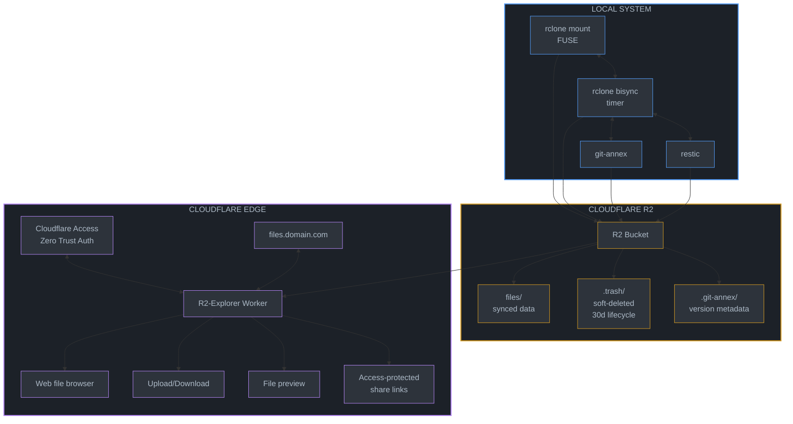

# r2-cloud-nix: Standalone R2 Cloud Storage Flake

## Overview

A self-contained Nix flake providing Cloudflare R2 cloud storage with:
- Easy bucket creation via CLI
- Local FUSE mount with 2-way background sync
- Version history tracking (git-annex + restic)
- Soft delete/trash with recovery
- Web interface for remote access and sharing (R2-Explorer)
- Authentication via Cloudflare Access

**This is a standalone repository** - completely independent from any existing NixOS configuration. Users import it as a flake input.

## Architecture



## Understanding git-annex (Key Design Decision)

**git-annex is NOT for separate "document buckets"** - it manages large files **within the same git repo** as your code/documents.

**How it works:**
1. In any git repo, `git annex add <large-file>` replaces the file with a symlink
2. The actual content is stored in `.git/annex/objects/` (content-addressed)
3. Git tracks the symlink (small), not the large file content
4. Content syncs to "special remotes" (R2 via rclone) with `git annex sync --content`
5. `git annex get <file>` downloads content; `git annex drop <file>` frees local space

**Example workflow:**
```bash
# In any project with large files
cd ~/projects/video-editing
git init && git annex init "laptop"

# Add R2 as special remote (uses your existing rclone r2 config)
git annex initremote r2 type=rclone \
  rcloneremotename=r2 \
  rcloneprefix=annex/video-editing \
  encryption=none

# Track large files with annex (code stays in git)
git annex add *.mp4 *.mov raw-footage/
git add *.py *.md   # Code/docs tracked normally by git
git commit -m "Initial commit"

# Sync content to R2
git annex sync --content

# Later, free local space
git annex drop raw-footage/  # Content still in R2
git annex get raw-footage/clip1.mp4  # Fetch when needed
```

**Key benefit**: One repo, one bucket prefix, mixed content (code + large files).

**Three sync strategies in this flake:**

| Strategy | Use Case | How It Works |
|----------|----------|--------------|
| **git-annex** | Git repos with large files | Symlinks + special remotes, per-file versioning |
| **rclone bisync** | Non-git folders (Downloads, Photos) | 2-way sync, --backup-dir for trash |
| **rclone mount** | Direct R2 access | FUSE mount with VFS cache |

Sources:
- [git-annex walkthrough](https://git-annex.branchable.com/walkthrough/)
- [rclone special remote](https://git-annex.branchable.com/special_remotes/rclone/)
- [rclone gitannex command](https://rclone.org/commands/rclone_gitannex/)

## Repository Structure

```
r2-cloud-nix/
├── flake.nix                    # Main flake definition
├── flake.lock
├── default.nix                  # Compatibility for non-flake users
│
├── modules/
│   ├── nixos/
│   │   ├── default.nix          # Aggregates all NixOS modules
│   │   ├── r2-sync.nix          # Mount + bisync systemd services
│   │   ├── r2-restic.nix        # Restic snapshots to R2
│   │   └── git-annex.nix        # git-annex with R2 special remote
│   │
│   └── home-manager/
│       ├── default.nix          # Aggregates all HM modules
│       ├── r2-credentials.nix   # Credentials management
│       ├── r2-cli.nix           # CLI wrappers (r2, r2-bucket, etc.)
│       └── rclone-config.nix    # rclone remote configuration
│
├── packages/
│   ├── r2-bucket.nix            # Bucket management CLI
│   ├── r2-cli.nix               # Enhanced rclone wrapper
│   └── r2-share.nix             # Presigned URL generator (S3 endpoint only)
│
├── lib/
│   └── r2.nix                   # Shared library functions
│
├── r2-explorer/                 # Cloudflare Worker (subflake)
│   ├── flake.nix
│   ├── src/
│   │   └── index.ts             # Worker entry point
│   ├── wrangler.toml
│   └── .github/
│       └── workflows/
│           └── deploy.yml       # CI/CD deployment
│
├── templates/
│   ├── minimal/                 # Minimal setup template
│   │   └── flake.nix
│   └── full/                    # Full setup with all features
│       └── flake.nix
│
├── docs/
│   ├── quickstart.md
│   ├── credentials.md
│   ├── sync.md
│   ├── versioning.md
│   └── sharing.md
│
└── README.md
```

## Flake Definition

```nix
# flake.nix
{
  description = "Cloudflare R2 cloud storage with sync, versioning, and sharing";

  inputs = {
    nixpkgs.url = "github:NixOS/nixpkgs/nixos-unstable";
    home-manager = {
      url = "github:nix-community/home-manager";
      inputs.nixpkgs.follows = "nixpkgs";
    };
    flake-parts.url = "github:hercules-ci/flake-parts";
  };

  outputs = inputs @ { self, nixpkgs, home-manager, flake-parts, ... }:
    flake-parts.lib.mkFlake { inherit inputs; } {
      systems = [ "x86_64-linux" "aarch64-linux" "x86_64-darwin" "aarch64-darwin" ];

      flake = {
        # NixOS modules
        nixosModules = {
          default = import ./modules/nixos;
          r2-sync = import ./modules/nixos/r2-sync.nix;
          r2-restic = import ./modules/nixos/r2-restic.nix;
          git-annex = import ./modules/nixos/git-annex.nix;
        };

        # Home Manager modules
        homeManagerModules = {
          default = import ./modules/home-manager;
          r2-credentials = import ./modules/home-manager/r2-credentials.nix;
          r2-cli = import ./modules/home-manager/r2-cli.nix;
          rclone-config = import ./modules/home-manager/rclone-config.nix;
        };

        # Project templates
        templates = {
          minimal = {
            path = ./templates/minimal;
            description = "Minimal R2 sync setup";
          };
          full = {
            path = ./templates/full;
            description = "Full R2 setup with versioning and web UI";
          };
        };

        # Library functions
        lib = import ./lib/r2.nix { inherit (nixpkgs) lib; };
      };

      perSystem = { pkgs, system, ... }: {
        # CLI packages
        packages = {
          r2-bucket = pkgs.callPackage ./packages/r2-bucket.nix { };
          r2-cli = pkgs.callPackage ./packages/r2-cli.nix { };
          r2-share = pkgs.callPackage ./packages/r2-share.nix { };
          default = pkgs.symlinkJoin {
            name = "r2-cloud-tools";
            paths = [
              self.packages.${system}.r2-bucket
              self.packages.${system}.r2-cli
              self.packages.${system}.r2-share
            ];
          };
        };

        # Development shell
        devShells.default = pkgs.mkShell {
          packages = with pkgs; [
            rclone
            restic
            git-annex
            nodePackages.wrangler
            nodejs
            jq
          ];
        };

        # Formatter
        formatter = pkgs.nixfmt-rfc-style;
      };
    };
}
```

## Module Specifications

### 1. NixOS Module: r2-sync.nix

```nix
{ config, lib, pkgs, ... }:
let
  cfg = config.services.r2-sync;
in
{
  options.services.r2-sync = {
    enable = lib.mkEnableOption "R2 mount and sync service";

    credentialsFile = lib.mkOption {
      type = lib.types.path;
      description = "Path to env file with R2 credentials";
      example = "/run/secrets/r2-credentials";
    };

    accountId = lib.mkOption {
      type = lib.types.str;
      description = "Cloudflare account ID";
    };

    mounts = lib.mkOption {
      type = lib.types.attrsOf (lib.types.submodule {
        options = {
          bucket = lib.mkOption {
            type = lib.types.str;
            description = "R2 bucket name";
          };

          mountPoint = lib.mkOption {
            type = lib.types.path;
            description = "Local mount path";
            example = "/mnt/r2/documents";
          };

          localPath = lib.mkOption {
            type = lib.types.nullOr lib.types.path;
            default = null;
            description = "Local path for bisync (if different from mountPoint)";
          };

          syncInterval = lib.mkOption {
            type = lib.types.str;
            default = "5m";
            description = "Bisync interval (systemd OnUnitActiveSec format)";
          };

          trashRetention = lib.mkOption {
            type = lib.types.int;
            default = 30;
            description = "Days to retain deleted files in .trash/";
          };

          vfsCache = {
            mode = lib.mkOption {
              type = lib.types.enum [ "off" "minimal" "writes" "full" ];
              default = "full";
            };
            maxSize = lib.mkOption {
              type = lib.types.str;
              default = "10G";
            };
            maxAge = lib.mkOption {
              type = lib.types.str;
              default = "24h";
            };
          };
        };
      });
      default = { };
      description = "R2 bucket mounts and sync configurations";
    };
  };

  config = lib.mkIf cfg.enable {
    environment.systemPackages = [ pkgs.rclone pkgs.fuse ];

    # Generate mount and sync services for each configured mount
    systemd.services = lib.mapAttrs' (name: mount: {
      name = "r2-mount-${name}";
      value = {
        description = "R2 FUSE mount for ${name}";
        after = [ "network-online.target" ];
        wants = [ "network-online.target" ];
        wantedBy = [ "multi-user.target" ];

        serviceConfig = {
          Type = "notify";
          EnvironmentFile = cfg.credentialsFile;
          ExecStart = ''
            ${pkgs.rclone}/bin/rclone mount \
              --config=/dev/null \
              --s3-provider=Cloudflare \
              --s3-endpoint=https://${cfg.accountId}.r2.cloudflarestorage.com \
              --s3-env-auth \
              --vfs-cache-mode=${mount.vfsCache.mode} \
              --vfs-cache-max-size=${mount.vfsCache.maxSize} \
              --vfs-cache-max-age=${mount.vfsCache.maxAge} \
              --allow-other \
              :s3:${mount.bucket} ${mount.mountPoint}
          '';
          ExecStop = "${pkgs.fuse}/bin/fusermount -u ${mount.mountPoint}";
          Restart = "on-failure";
          RestartSec = "5s";
        };

        preStart = "mkdir -p ${mount.mountPoint}";
      };
    }) cfg.mounts // lib.mapAttrs' (name: mount: {
      name = "r2-bisync-${name}";
      value = {
        description = "R2 bisync for ${name}";
        after = [ "r2-mount-${name}.service" ];
        requires = [ "r2-mount-${name}.service" ];

        serviceConfig = {
          Type = "oneshot";
          EnvironmentFile = cfg.credentialsFile;
          ExecStart = let
            localPath = if mount.localPath != null then mount.localPath else mount.mountPoint;
          in ''
            ${pkgs.rclone}/bin/rclone bisync \
              --config=/dev/null \
              --s3-provider=Cloudflare \
              --s3-endpoint=https://${cfg.accountId}.r2.cloudflarestorage.com \
              --s3-env-auth \
              ${localPath} :s3:${mount.bucket} \
              --backup-dir1=${localPath}/.trash \
              --backup-dir2=:s3:${mount.bucket}/.trash \
              --max-delete=50% \
              --check-access
          '';
        };
      };
    }) cfg.mounts;

    systemd.timers = lib.mapAttrs' (name: mount: {
      name = "r2-bisync-${name}";
      value = {
        description = "R2 bisync timer for ${name}";
        wantedBy = [ "timers.target" ];
        timerConfig = {
          OnBootSec = "2m";
          OnUnitActiveSec = mount.syncInterval;
          Unit = "r2-bisync-${name}.service";
        };
      };
    }) cfg.mounts;
  };
}
```

### 2. NixOS Module: r2-restic.nix

```nix
{ config, lib, pkgs, ... }:
let
  cfg = config.services.r2-restic;
in
{
  options.services.r2-restic = {
    enable = lib.mkEnableOption "Restic backups to R2";

    credentialsFile = lib.mkOption {
      type = lib.types.path;
      description = "Path to env file with R2 credentials";
    };

    accountId = lib.mkOption {
      type = lib.types.str;
      description = "Cloudflare account ID";
    };

    passwordFile = lib.mkOption {
      type = lib.types.path;
      description = "Path to restic repository password";
    };

    bucket = lib.mkOption {
      type = lib.types.str;
      description = "R2 bucket for restic repository";
    };

    paths = lib.mkOption {
      type = lib.types.listOf lib.types.path;
      description = "Paths to back up";
    };

    exclude = lib.mkOption {
      type = lib.types.listOf lib.types.str;
      default = [ ];
      description = "Patterns to exclude";
    };

    schedule = lib.mkOption {
      type = lib.types.str;
      default = "daily";
      description = "Backup schedule (systemd calendar format)";
    };

    retention = {
      daily = lib.mkOption { type = lib.types.int; default = 7; };
      weekly = lib.mkOption { type = lib.types.int; default = 4; };
      monthly = lib.mkOption { type = lib.types.int; default = 12; };
      yearly = lib.mkOption { type = lib.types.int; default = 3; };
    };
  };

  config = lib.mkIf cfg.enable {
    systemd.services.r2-restic-backup = {
      description = "Restic backup to R2";
      after = [ "network-online.target" ];
      wants = [ "network-online.target" ];

      environment = {
        RESTIC_REPOSITORY = "s3:https://${cfg.accountId}.r2.cloudflarestorage.com/${cfg.bucket}";
        RESTIC_PASSWORD_FILE = cfg.passwordFile;
      };

      serviceConfig = {
        Type = "oneshot";
        EnvironmentFile = cfg.credentialsFile;
        ExecStart = pkgs.writeShellScript "restic-backup" ''
          ${pkgs.restic}/bin/restic backup \
            ${lib.concatMapStringsSep " " (p: "--exclude='${p}'") cfg.exclude} \
            ${lib.concatStringsSep " " cfg.paths}

          ${pkgs.restic}/bin/restic forget \
            --keep-daily ${toString cfg.retention.daily} \
            --keep-weekly ${toString cfg.retention.weekly} \
            --keep-monthly ${toString cfg.retention.monthly} \
            --keep-yearly ${toString cfg.retention.yearly} \
            --prune
        '';
      };
    };

    systemd.timers.r2-restic-backup = {
      description = "Restic backup timer";
      wantedBy = [ "timers.target" ];
      timerConfig = {
        OnCalendar = cfg.schedule;
        Persistent = true;
        RandomizedDelaySec = "1h";
      };
    };
  };
}
```

### 3. NixOS Module: git-annex.nix

Provides git-annex with R2 integration. This doesn't create services—it just ensures git-annex is available with proper rclone integration.

```nix
{ config, lib, pkgs, ... }:
let
  cfg = config.programs.git-annex-r2;

  # Helper script to initialize git-annex with R2 special remote
  git-annex-r2-init = pkgs.writeShellScriptBin "git-annex-r2-init" ''
    set -euo pipefail

    # Load R2 credentials
    if [[ -f "${cfg.credentialsFile}" ]]; then
      set -a; source "${cfg.credentialsFile}"; set +a
    fi

    ACCOUNT_ID="''${R2_ACCOUNT_ID:-}"
    [[ -z "$ACCOUNT_ID" ]] && { echo "Error: R2_ACCOUNT_ID not set"; exit 1; }

    remote_name="''${1:-r2}"
    bucket="''${2:-$(basename "$PWD")}"
    prefix="''${3:-annex/$bucket}"

    # Initialize git-annex if not already
    if ! git annex version &>/dev/null; then
      git annex init "$(hostname)"
    fi

    # Check if remote already exists
    if git annex info "$remote_name" &>/dev/null; then
      echo "Remote '$remote_name' already exists"
      exit 0
    fi

    # Initialize R2 as special remote
    git annex initremote "$remote_name" \
      type=rclone \
      rcloneremotename=r2 \
      rcloneprefix="$prefix" \
      encryption=none

    echo "Initialized R2 special remote:"
    echo "  Remote: $remote_name"
    echo "  Bucket: r2:$prefix"
    echo ""
    echo "Usage:"
    echo "  git annex add <large-files>    # Track with annex"
    echo "  git annex sync --content       # Sync to R2"
    echo "  git annex drop <file>          # Free local space"
    echo "  git annex get <file>           # Fetch from R2"
  '';
in
{
  options.programs.git-annex-r2 = {
    enable = lib.mkEnableOption "git-annex with R2 integration";

    credentialsFile = lib.mkOption {
      type = lib.types.path;
      description = "Path to R2 credentials env file";
      example = "/run/secrets/r2-credentials";
    };
  };

  config = lib.mkIf cfg.enable {
    environment.systemPackages = [
      pkgs.git-annex
      git-annex-r2-init
    ];
  };
}
```

**Usage:**
```bash
cd ~/projects/my-repo
git-annex-r2-init              # Uses defaults: remote=r2, bucket=my-repo
git-annex-r2-init cloud mybucket annex/custom-prefix  # Custom config

git annex add large-file.zip
git commit -m "Add large file"
git annex sync --content       # Pushes to R2
```

### 4. Home Manager Module: r2-cli.nix

```nix
{ config, lib, pkgs, ... }:
let
  cfg = config.programs.r2-cloud;

  r2-bucket = pkgs.writeShellScriptBin "r2-bucket" ''
    set -euo pipefail

    # Load credentials
    if [[ -f "${cfg.credentialsFile}" ]]; then
      set -a; source "${cfg.credentialsFile}"; set +a
    fi

    ACCOUNT_ID="''${R2_ACCOUNT_ID:-}"
    [[ -z "$ACCOUNT_ID" ]] && { echo "Error: R2_ACCOUNT_ID not set"; exit 1; }

    cmd="''${1:-help}"
    shift || true

    case "$cmd" in
      create)
        name="''${1:?Bucket name required}"
        ${pkgs.nodePackages.wrangler}/bin/wrangler r2 bucket create "$name"
        echo "Created bucket: $name"
        ;;
      list)
        ${pkgs.nodePackages.wrangler}/bin/wrangler r2 bucket list
        ;;
      delete)
        name="''${1:?Bucket name required}"
        read -p "Delete bucket '$name'? [y/N] " confirm
        [[ "$confirm" =~ ^[Yy]$ ]] || { echo "Cancelled"; exit 0; }
        ${pkgs.nodePackages.wrangler}/bin/wrangler r2 bucket delete "$name"
        ;;
      lifecycle)
        name="''${1:?Bucket name required}"
        days="''${2:-30}"
        # Set lifecycle via Wrangler (supported)
        rules_file="$(mktemp)"
        cat > "$rules_file" <<JSON
{"rules":[{"id":"trash-cleanup","prefix":".trash/","expiration":{"days":$days}}]}
JSON
        ${pkgs.nodePackages.wrangler}/bin/wrangler r2 bucket lifecycle set "$name" --file "$rules_file"
        rm -f "$rules_file"
        echo "Set .trash/ retention to $days days"
        ;;
      help|*)
        echo "Usage: r2-bucket <command> [args]"
        echo ""
        echo "Commands:"
        echo "  create <name>         Create a new bucket"
        echo "  list                  List all buckets"
        echo "  delete <name>         Delete a bucket"
        echo "  lifecycle <name> [d]  Set trash retention (default: 30 days)"
        ;;
    esac
  '';

  r2-share = pkgs.writeShellScriptBin "r2-share" ''
    set -euo pipefail

    if [[ -f "${cfg.credentialsFile}" ]]; then
      set -a; source "${cfg.credentialsFile}"; set +a
    fi

    ACCOUNT_ID="''${R2_ACCOUNT_ID:-}"
    [[ -z "$ACCOUNT_ID" ]] && { echo "Error: R2_ACCOUNT_ID not set"; exit 1; }

    bucket="''${1:?Usage: r2-share <bucket> <key> [expiry]}"
    key="''${2:?Usage: r2-share <bucket> <key> [expiry]}"
    expiry="''${3:-24h}"

    ${pkgs.rclone}/bin/rclone link \
      --config=/dev/null \
      --s3-provider=Cloudflare \
      --s3-endpoint="https://$ACCOUNT_ID.r2.cloudflarestorage.com" \
      --s3-access-key-id="$AWS_ACCESS_KEY_ID" \
      --s3-secret-access-key="$AWS_SECRET_ACCESS_KEY" \
      --expire="$expiry" \
      ":s3:$bucket/$key"
  '';
in
{
  options.programs.r2-cloud = {
    enable = lib.mkEnableOption "R2 cloud CLI tools";

    credentialsFile = lib.mkOption {
      type = lib.types.path;
      default = "${config.xdg.configHome}/cloudflare/r2/env";
      description = "Path to credentials env file";
    };

    accountId = lib.mkOption {
      type = lib.types.str;
      description = "Cloudflare account ID";
    };

    enableRcloneRemote = lib.mkOption {
      type = lib.types.bool;
      default = true;
      description = "Configure 'r2' remote in rclone";
    };
  };

  config = lib.mkIf cfg.enable {
    home.packages = [
      r2-bucket
      r2-share
      pkgs.rclone
      pkgs.git-annex
      pkgs.restic
    ];

    # Configure rclone remote
    programs.rclone = lib.mkIf cfg.enableRcloneRemote {
      enable = true;
      remotes.r2 = {
        type = "s3";
        provider = "Cloudflare";
        endpoint = "https://${cfg.accountId}.r2.cloudflarestorage.com";
        env_auth = true;
      };
    };

    # Wrapper script that sources credentials
    home.shellAliases = {
      r2 = ''(set -a; source "${cfg.credentialsFile}"; set +a; rclone "$@" --config ~/.config/rclone/rclone.conf)'';
    };
  };
}
```

### 5. Home Manager Module: r2-credentials.nix

```nix
{ config, lib, pkgs, ... }:
let
  cfg = config.programs.r2-cloud.credentials;
in
{
  options.programs.r2-cloud.credentials = {
    manage = lib.mkEnableOption "Manage R2 credentials file";

    accountId = lib.mkOption {
      type = lib.types.str;
      description = "Cloudflare account ID";
    };

    # These would typically come from sops-nix or agenix
    accessKeyIdFile = lib.mkOption {
      type = lib.types.nullOr lib.types.path;
      default = null;
      description = "Path to file containing access key ID";
    };

    secretAccessKeyFile = lib.mkOption {
      type = lib.types.nullOr lib.types.path;
      default = null;
      description = "Path to file containing secret access key";
    };
  };

  config = lib.mkIf cfg.manage {
    # Create credentials directory
    xdg.configFile."cloudflare/r2/.keep".text = "";

    # Activation script to assemble credentials
    home.activation.r2-credentials = lib.hm.dag.entryAfter [ "writeBoundary" ] ''
      mkdir -p ${config.xdg.configHome}/cloudflare/r2
      cat > ${config.xdg.configHome}/cloudflare/r2/env << EOF
      R2_ACCOUNT_ID=${cfg.accountId}
      AWS_ACCESS_KEY_ID=$(cat ${cfg.accessKeyIdFile})
      AWS_SECRET_ACCESS_KEY=$(cat ${cfg.secretAccessKeyFile})
      EOF
      chmod 0400 ${config.xdg.configHome}/cloudflare/r2/env
    '';
  };
}
```

## Usage Examples

### Minimal Setup (Consumer's flake.nix)

```nix
{
  inputs = {
    nixpkgs.url = "github:NixOS/nixpkgs/nixos-unstable";
    home-manager.url = "github:nix-community/home-manager";
    r2-cloud.url = "github:username/r2-cloud-nix";
  };

  outputs = { nixpkgs, home-manager, r2-cloud, ... }: {
    nixosConfigurations.myhost = nixpkgs.lib.nixosSystem {
      modules = [
        r2-cloud.nixosModules.default
        {
          services.r2-sync = {
            enable = true;
            accountId = "abc123def456";
            credentialsFile = "/run/secrets/r2-credentials";
            mounts.documents = {
              bucket = "my-documents";
              mountPoint = "/mnt/r2/documents";
              syncInterval = "10m";
            };
          };
        }
      ];
    };

    homeConfigurations.myuser = home-manager.lib.homeManagerConfiguration {
      modules = [
        r2-cloud.homeManagerModules.default
        {
          programs.r2-cloud = {
            enable = true;
            accountId = "abc123def456";
          };
        }
      ];
    };
  };
}
```

### Full Setup with Restic

```nix
{
  services.r2-sync = {
    enable = true;
    accountId = "abc123def456";
    credentialsFile = "/run/secrets/r2-credentials";

    mounts = {
      documents = {
        bucket = "documents";
        mountPoint = "/mnt/r2/documents";
        syncInterval = "5m";
      };
      photos = {
        bucket = "photos";
        mountPoint = "/mnt/r2/photos";
        syncInterval = "15m";
        vfsCache.maxSize = "20G";
      };
    };
  };

  services.r2-restic = {
    enable = true;
    accountId = "abc123def456";
    credentialsFile = "/run/secrets/r2-credentials";
    passwordFile = "/run/secrets/restic-password";
    bucket = "backups";
    paths = [ "/home/user/important" "/mnt/r2/documents" ];
    exclude = [ "*.tmp" ".cache" "node_modules" ];
    schedule = "daily";
    retention = {
      daily = 7;
      weekly = 4;
      monthly = 12;
    };
  };
}
```

## R2-Explorer Subflake

The `r2-explorer/` directory is a separate subflake for the web interface:

```nix
# r2-explorer/flake.nix
{
  description = "R2-Explorer Cloudflare Worker";

  inputs = {
    nixpkgs.url = "github:NixOS/nixpkgs/nixos-unstable";
  };

  outputs = { nixpkgs, ... }:
    let
      systems = [ "x86_64-linux" "aarch64-linux" "x86_64-darwin" "aarch64-darwin" ];
      forAllSystems = f: nixpkgs.lib.genAttrs systems (system: f nixpkgs.legacyPackages.${system});
    in
    {
      devShells = forAllSystems (pkgs: {
        default = pkgs.mkShell {
          packages = with pkgs; [
            nodejs
            nodePackages.pnpm
            nodePackages.wrangler
          ];
        };
      });

      # CI deployment script
      packages = forAllSystems (pkgs: {
        deploy = pkgs.writeShellScriptBin "deploy-r2-explorer" ''
          cd ${./.}
          ${pkgs.nodePackages.pnpm}/bin/pnpm install
          ${pkgs.nodePackages.wrangler}/bin/wrangler deploy
        '';
      });
    };
}
```

### CI/CD Deployment

```yaml
# r2-explorer/.github/workflows/deploy.yml
name: Deploy R2-Explorer

on:
  push:
    branches: [main]
  workflow_dispatch:

jobs:
  deploy:
    runs-on: ubuntu-latest
    steps:
      - uses: actions/checkout@v4

      - uses: cachix/install-nix-action@v27
        with:
          nix_path: nixpkgs=channel:nixos-unstable

      - name: Build and Deploy
        env:
          CLOUDFLARE_API_TOKEN: ${{ secrets.CLOUDFLARE_API_TOKEN }}
        run: |
          nix develop --command bash -c "pnpm install && wrangler deploy"
```

## Authentication Setup

### Cloudflare Access (Zero Trust)

Configure in Cloudflare dashboard:

1. **Identity Providers** (Zero Trust → Settings → Authentication):
   - GitHub OAuth
   - Email OTP (One-time PIN)
   - Apple Login (if available)

2. **Access Application**:
   - Domain: `files.yourdomain.com`
   - Policies:
     - Allow: GitHub org members
     - Allow: Specific email addresses

### Sharing Modes and Constraints

#### Presigned URLs (S3 endpoint only)

Use the `r2-share` CLI for quick sharing. These links are always on the S3 endpoint
(`https://<account_id>.r2.cloudflarestorage.com`) and **do not** pass through the custom
domain or Cloudflare Access.
```bash
# Share file for 24 hours (default)
r2-share documents report.pdf

# Share for 7 days
r2-share documents report.pdf 168h
```

#### Access-Protected Share Links (custom domain)

Use the Worker (R2-Explorer) to mint share tokens and proxy downloads on the custom
domain. Links are served under `https://files.yourdomain.com/share/<token>` and are
protected by Cloudflare Access. The Worker validates the HMAC token and fetches the
object from R2.

## Files to Create

| File | Purpose |
|------|---------|
| `flake.nix` | Main flake with all outputs |
| `modules/nixos/default.nix` | NixOS module aggregator |
| `modules/nixos/r2-sync.nix` | Mount + bisync service |
| `modules/nixos/r2-restic.nix` | Restic backup service |
| `modules/nixos/git-annex.nix` | git-annex module (optional) |
| `modules/home-manager/default.nix` | HM module aggregator |
| `modules/home-manager/r2-cli.nix` | CLI wrappers |
| `modules/home-manager/r2-credentials.nix` | Credentials management |
| `packages/r2-bucket.nix` | Standalone bucket CLI |
| `packages/r2-share.nix` | Presigned URL generator (S3 endpoint only) |
| `lib/r2.nix` | Shared library functions |
| `r2-explorer/flake.nix` | Worker subflake |
| `r2-explorer/wrangler.toml` | Worker config |
| `templates/minimal/flake.nix` | Minimal usage template |
| `templates/full/flake.nix` | Full usage template |
| `README.md` | Documentation |

## Verification

### After Repository Setup

```bash
# Create the repository
mkdir r2-cloud-nix && cd r2-cloud-nix
git init

# Build and check
nix flake check
nix build .#r2-bucket
nix build .#r2-share

# Test CLI tools
nix run .#r2-bucket -- help
nix run .#r2-share -- --help

# Enter dev shell
nix develop
```

### After Consumer Integration

```bash
# On consumer system after nixos-rebuild
r2-bucket list
r2-bucket create test-bucket
r2-bucket lifecycle test-bucket 30
# Verify lifecycle (requires wrangler in PATH)
wrangler r2 bucket lifecycle get test-bucket
sudo systemctl status r2-mount-documents
ls /mnt/r2/documents

# Test sync
echo "test" > /mnt/r2/documents/test.txt
sudo systemctl start r2-bisync-documents
r2 ls r2:documents/

# Test sharing
# Presigned (S3 endpoint only)
r2-share documents test.txt

# Access-protected (custom domain via Worker)
curl -I https://files.yourdomain.com/share/<token>
# Should redirect to Cloudflare Access when not authenticated
```

### R2-Explorer Deployment

```bash
cd r2-explorer
nix develop
wrangler login
wrangler deploy

# Verify
curl -I https://files.yourdomain.com
# Should redirect to Cloudflare Access
curl -I https://files.yourdomain.com/share/<token>
# Should redirect to Cloudflare Access when not authenticated
```

## Implementation Order

1. [x] **Phase 1**: Repository scaffold + flake.nix
2. [x] **Phase 2**: NixOS modules (r2-sync.nix, r2-restic.nix)
3. [ ] **Phase 3**: Home Manager modules (r2-cli.nix, r2-credentials.nix)
4. [ ] **Phase 4**: CLI packages (r2-bucket, r2-share)
5. [ ] **Phase 5**: R2-Explorer subflake
6. [ ] **Phase 6**: Templates and documentation
7. [ ] **Phase 7**: CI/CD setup
