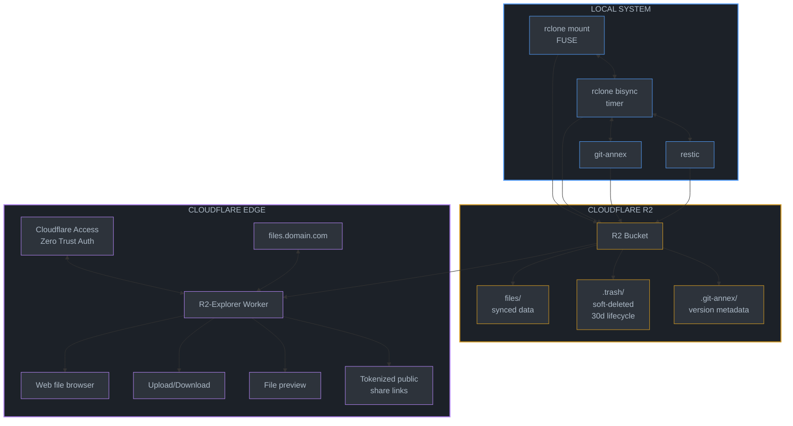

# r2-cloud-nix: Standalone R2 Cloud Storage Flake

## Overview

A self-contained Nix flake providing Cloudflare R2 cloud storage with:

- Easy bucket creation via CLI
- Local FUSE mount with 2-way background sync
- Version history tracking (git-annex + restic)
- Soft delete/trash with recovery
- Web interface for remote access and sharing (R2-Explorer)
- Authentication via Cloudflare Access

**This is a standalone repository** - completely independent from any existing NixOS configuration. Users import it as a flake input.

## Architecture



## Understanding git-annex (Key Design Decision)

**git-annex is NOT for separate "document buckets"** - it manages large files **within the same git repo** as your code/documents.

**How it works:**

1. In any git repo, `git annex add <large-file>` replaces the file with a symlink
2. The actual content is stored in `.git/annex/objects/` (content-addressed)
3. Git tracks the symlink (small), not the large file content
4. Content syncs to "special remotes" (R2 via rclone) with `git annex sync --content`
5. `git annex get <file>` downloads content; `git annex drop <file>` frees local space

**Example workflow:**

```bash
# In any project with large files
cd ~/projects/video-editing
git init && git annex init "laptop"

# Add R2 as special remote (uses your existing rclone r2 config)
git annex initremote r2 type=rclone \
  rcloneremotename=r2 \
  rcloneprefix=annex/video-editing \
  encryption=none

# Track large files with annex (code stays in git)
git annex add *.mp4 *.mov raw-footage/
git add *.py *.md   # Code/docs tracked normally by git
git commit -m "Initial commit"

# Sync content to R2
git annex sync --content

# Later, free local space
git annex drop raw-footage/  # Content still in R2
git annex get raw-footage/clip1.mp4  # Fetch when needed
```

**Key benefit**: One repo, one bucket prefix, mixed content (code + large files).

**Three sync strategies in this flake:**

| Strategy          | Use Case                            | How It Works                                    |
| ----------------- | ----------------------------------- | ----------------------------------------------- |
| **git-annex**     | Git repos with large files          | Symlinks + special remotes, per-file versioning |
| **rclone bisync** | Non-git folders (Downloads, Photos) | 2-way sync, --backup-dir for trash              |
| **rclone mount**  | Direct R2 access                    | FUSE mount with VFS cache                       |

Sources:

- [git-annex walkthrough](https://git-annex.branchable.com/walkthrough/)
- [rclone special remote](https://git-annex.branchable.com/special_remotes/rclone/)
- [rclone gitannex command](https://rclone.org/commands/rclone_gitannex/)

## Repository Structure

```
r2-cloud-nix/
├── flake.nix                    # Main flake definition
├── flake.lock
├── default.nix                  # Compatibility for non-flake users
│
├── modules/
│   ├── nixos/
│   │   ├── default.nix          # Aggregates all NixOS modules
│   │   ├── r2-sync.nix          # Mount + bisync systemd services
│   │   ├── r2-restic.nix        # Restic snapshots to R2
│   │   └── git-annex.nix        # git-annex with R2 special remote
│   │
│   └── home-manager/
│       ├── default.nix          # Aggregates all HM modules
│       ├── r2-credentials.nix   # Credentials management
│       ├── r2-cli.nix           # CLI integration wrappers (env/default injection)
│       └── rclone-config.nix    # rclone remote configuration
│
├── packages/
│   └── r2-cli.nix               # Primary `r2` subcommand CLI
│
├── lib/
│   └── r2.nix                   # Shared library functions
│
├── r2-explorer/                 # Cloudflare Worker subflake
│   ├── flake.nix
│   ├── package.json
│   ├── pnpm-lock.yaml
│   ├── tsconfig.json
│   ├── vitest.config.ts
│   ├── wrangler.toml
│   ├── src/
│   │   ├── index.ts             # Worker entry point
│   │   ├── app.ts               # Hono app + route handlers
│   │   ├── schemas.ts           # Zod request/response contracts
│   │   ├── auth.ts              # Access/HMAC auth helpers
│   │   ├── kv.ts                # Share KV state operations
│   │   ├── r2.ts                # R2 object operations
│   │   ├── http.ts              # Error/response helpers
│   │   ├── ui.ts                # Embedded dashboard UI
│   │   ├── types.ts             # Worker environment/types
│   │   └── version.ts
│   ├── tests/
│   │   ├── auth.spec.ts
│   │   ├── share.spec.ts
│   │   ├── multipart.spec.ts
│   │   ├── readonly.spec.ts
│   │   ├── server-info.spec.ts
│   │   └── helpers/
│   │       └── memory.ts
│   └── .github/
│       └── workflows/
│           └── deploy.yml       # Phase 7 hardening target
│
├── templates/
│   ├── minimal/                 # Minimal setup template
│   │   └── flake.nix
│   └── full/                    # Full setup with all features
│       └── flake.nix
│
├── docs/
│   ├── quickstart.md
│   ├── credentials.md
│   ├── sync.md
│   ├── versioning.md
│   ├── sharing.md
│   ├── troubleshooting.md
│   ├── operators/
│   │   ├── index.md
│   │   ├── key-rotation.md
│   │   ├── readonly-maintenance.md
│   │   ├── access-policy-split.md
│   │   ├── incident-response.md
│   │   └── rollback-worker-share.md
│   └── reference/
│       └── index.md
│
└── README.md
```

## Flake Definition

```nix
# flake.nix
{
  description = "Cloudflare R2 cloud storage with sync, versioning, and sharing";

  inputs = {
    nixpkgs.url = "github:NixOS/nixpkgs/nixos-unstable";
    home-manager = {
      url = "github:nix-community/home-manager";
      inputs.nixpkgs.follows = "nixpkgs";
    };
    flake-parts.url = "github:hercules-ci/flake-parts";
  };

  outputs = inputs @ { self, nixpkgs, home-manager, flake-parts, ... }:
    flake-parts.lib.mkFlake { inherit inputs; } {
      systems = [ "x86_64-linux" "aarch64-linux" "x86_64-darwin" "aarch64-darwin" ];

      flake = {
        # NixOS modules
        nixosModules = {
          default = import ./modules/nixos;
          r2-sync = import ./modules/nixos/r2-sync.nix;
          r2-restic = import ./modules/nixos/r2-restic.nix;
          git-annex = import ./modules/nixos/git-annex.nix;
        };

        # Home Manager modules
        homeManagerModules = {
          default = import ./modules/home-manager;
          r2-credentials = import ./modules/home-manager/r2-credentials.nix;
          r2-cli = import ./modules/home-manager/r2-cli.nix;
          rclone-config = import ./modules/home-manager/rclone-config.nix;
        };

        # Project templates
        templates = {
          minimal = {
            path = ./templates/minimal;
            description = "Minimal R2 sync setup";
          };
          full = {
            path = ./templates/full;
            description = "Full R2 setup with versioning and web UI";
          };
        };

        # Library functions
        lib = import ./lib/r2.nix { inherit (nixpkgs) lib; };
      };

      perSystem = { pkgs, system, ... }: {
        # CLI packages
        packages = {
          r2 = pkgs.callPackage ./packages/r2-cli.nix { };
          default = pkgs.symlinkJoin {
            name = "r2-cloud-tools";
            paths = [
              self.packages.${system}.r2
            ];
          };
        };

        # Development shell
        devShells.default = pkgs.mkShell {
          packages = with pkgs; [
            rclone
            restic
            git-annex
            nodePackages.wrangler
            nodejs
            jq
          ];
        };

        # Formatter
        formatter = pkgs.nixfmt-rfc-style;
      };
    };
}
```

## Module Specifications

### 1. NixOS Module: r2-sync.nix

```nix
{ config, lib, pkgs, ... }:
let
  cfg = config.services.r2-sync;
in
{
  options.services.r2-sync = {
    enable = lib.mkEnableOption "R2 mount and sync service";

    credentialsFile = lib.mkOption {
      type = lib.types.path;
      description = "Path to env file with R2 credentials";
      example = "/run/secrets/r2/credentials.env";
    };

    accountId = lib.mkOption {
      type = lib.types.str;
      description = "Cloudflare account ID";
    };

    accountIdFile = lib.mkOption {
      type = lib.types.nullOr lib.types.path;
      default = null;
      description = "Path to file containing Cloudflare account ID";
      example = "/run/secrets/r2/account-id";
    };

    mounts = lib.mkOption {
      type = lib.types.attrsOf (lib.types.submodule {
        options = {
          bucket = lib.mkOption {
            type = lib.types.str;
            description = "R2 bucket name";
          };

          mountPoint = lib.mkOption {
            type = lib.types.path;
            description = "Local mount path";
            example = "/mnt/r2/documents";
          };

          localPath = lib.mkOption {
            type = lib.types.nullOr lib.types.path;
            default = null;
            description = "Local path for bisync (if different from mountPoint)";
          };

          syncInterval = lib.mkOption {
            type = lib.types.str;
            default = "5m";
            description = "Bisync interval (systemd OnUnitActiveSec format)";
          };

          trashRetention = lib.mkOption {
            type = lib.types.int;
            default = 30;
            description = "Days to retain deleted files in .trash/";
          };

          vfsCache = {
            mode = lib.mkOption {
              type = lib.types.enum [ "off" "minimal" "writes" "full" ];
              default = "full";
            };
            maxSize = lib.mkOption {
              type = lib.types.str;
              default = "10G";
            };
            maxAge = lib.mkOption {
              type = lib.types.str;
              default = "24h";
            };
          };
        };
      });
      default = { };
      description = "R2 bucket mounts and sync configurations";
    };
  };

  config = lib.mkIf cfg.enable {
    environment.systemPackages = [ pkgs.rclone pkgs.fuse ];

    # Generate mount and sync services for each configured mount
    systemd.services = lib.mapAttrs' (name: mount: {
      name = "r2-mount-${name}";
      value = {
        description = "R2 FUSE mount for ${name}";
        after = [ "network-online.target" ];
        wants = [ "network-online.target" ];
        wantedBy = [ "multi-user.target" ];

        serviceConfig = {
          Type = "notify";
          EnvironmentFile = cfg.credentialsFile;
          ExecStart = ''
            ${pkgs.rclone}/bin/rclone mount \
              --config=/dev/null \
              --s3-provider=Cloudflare \
              --s3-endpoint=https://${cfg.accountId}.r2.cloudflarestorage.com \
              --s3-env-auth \
              --vfs-cache-mode=${mount.vfsCache.mode} \
              --vfs-cache-max-size=${mount.vfsCache.maxSize} \
              --vfs-cache-max-age=${mount.vfsCache.maxAge} \
              --allow-other \
              :s3:${mount.bucket} ${mount.mountPoint}
          '';
          ExecStop = "${pkgs.fuse}/bin/fusermount -u ${mount.mountPoint}";
          Restart = "on-failure";
          RestartSec = "5s";
        };

        preStart = "mkdir -p ${mount.mountPoint}";
      };
    }) cfg.mounts // lib.mapAttrs' (name: mount: {
      name = "r2-bisync-${name}";
      value = {
        description = "R2 bisync for ${name}";
        after = [ "r2-mount-${name}.service" ];
        requires = [ "r2-mount-${name}.service" ];

        serviceConfig = {
          Type = "oneshot";
          EnvironmentFile = cfg.credentialsFile;
          ExecStart = let
            localPath = if mount.localPath != null then mount.localPath else mount.mountPoint;
          in ''
            ${pkgs.rclone}/bin/rclone bisync \
              --config=/dev/null \
              --s3-provider=Cloudflare \
              --s3-endpoint=https://${cfg.accountId}.r2.cloudflarestorage.com \
              --s3-env-auth \
              ${localPath} :s3:${mount.bucket} \
              --backup-dir1=${localPath}/.trash \
              --backup-dir2=:s3:${mount.bucket}/.trash \
              --max-delete=50% \
              --check-access
          '';
        };
      };
    }) cfg.mounts;

    systemd.timers = lib.mapAttrs' (name: mount: {
      name = "r2-bisync-${name}";
      value = {
        description = "R2 bisync timer for ${name}";
        wantedBy = [ "timers.target" ];
        timerConfig = {
          OnBootSec = "2m";
          OnUnitActiveSec = mount.syncInterval;
          Unit = "r2-bisync-${name}.service";
        };
      };
    }) cfg.mounts;
  };
}
```

Credentials model note (system scope):

- Secrets live in `secrets/r2.yaml`.
- sops-nix extracts keys to `/run/secrets/r2/*`.
- sops templates render `/run/secrets/r2/credentials.env` for system services.

### 2. NixOS Module: r2-restic.nix

```nix
{ config, lib, pkgs, ... }:
let
  cfg = config.services.r2-restic;
in
{
  options.services.r2-restic = {
    enable = lib.mkEnableOption "Restic backups to R2";

    credentialsFile = lib.mkOption {
      type = lib.types.path;
      description = "Path to env file with R2 credentials";
    };

    accountId = lib.mkOption {
      type = lib.types.str;
      description = "Cloudflare account ID";
    };

    passwordFile = lib.mkOption {
      type = lib.types.path;
      description = "Path to restic repository password";
    };

    bucket = lib.mkOption {
      type = lib.types.str;
      description = "R2 bucket for restic repository";
    };

    paths = lib.mkOption {
      type = lib.types.listOf lib.types.path;
      description = "Paths to back up";
    };

    exclude = lib.mkOption {
      type = lib.types.listOf lib.types.str;
      default = [ ];
      description = "Patterns to exclude";
    };

    schedule = lib.mkOption {
      type = lib.types.str;
      default = "daily";
      description = "Backup schedule (systemd calendar format)";
    };

    retention = {
      daily = lib.mkOption { type = lib.types.int; default = 7; };
      weekly = lib.mkOption { type = lib.types.int; default = 4; };
      monthly = lib.mkOption { type = lib.types.int; default = 12; };
      yearly = lib.mkOption { type = lib.types.int; default = 3; };
    };
  };

  config = lib.mkIf cfg.enable {
    systemd.services.r2-restic-backup = {
      description = "Restic backup to R2";
      after = [ "network-online.target" ];
      wants = [ "network-online.target" ];

      environment = {
        RESTIC_REPOSITORY = "s3:https://${cfg.accountId}.r2.cloudflarestorage.com/${cfg.bucket}";
        RESTIC_PASSWORD_FILE = cfg.passwordFile;
      };

      serviceConfig = {
        Type = "oneshot";
        EnvironmentFile = cfg.credentialsFile;
        ExecStart = pkgs.writeShellScript "restic-backup" ''
          ${pkgs.restic}/bin/restic backup \
            ${lib.concatMapStringsSep " " (p: "--exclude='${p}'") cfg.exclude} \
            ${lib.concatStringsSep " " cfg.paths}

          ${pkgs.restic}/bin/restic forget \
            --keep-daily ${toString cfg.retention.daily} \
            --keep-weekly ${toString cfg.retention.weekly} \
            --keep-monthly ${toString cfg.retention.monthly} \
            --keep-yearly ${toString cfg.retention.yearly} \
            --prune
        '';
      };
    };

    systemd.timers.r2-restic-backup = {
      description = "Restic backup timer";
      wantedBy = [ "timers.target" ];
      timerConfig = {
        OnCalendar = cfg.schedule;
        Persistent = true;
        RandomizedDelaySec = "1h";
      };
    };
  };
}
```

### 3. NixOS Module: git-annex.nix

Provides git-annex with R2 integration. This doesn't create services—it just ensures git-annex is available with proper rclone integration.

```nix
{ config, lib, pkgs, ... }:
let
  cfg = config.programs.git-annex-r2;

  # Helper script to initialize git-annex with R2 special remote
  git-annex-r2-init = pkgs.writeShellScriptBin "git-annex-r2-init" ''
    set -euo pipefail

    # Load R2 credentials
    if [[ -f "${cfg.credentialsFile}" ]]; then
      set -a; source "${cfg.credentialsFile}"; set +a
    fi

    ACCOUNT_ID="''${R2_ACCOUNT_ID:-}"
    [[ -z "$ACCOUNT_ID" ]] && { echo "Error: R2_ACCOUNT_ID not set"; exit 1; }

    remote_name="''${1:-r2}"
    bucket="''${2:-$(basename "$PWD")}"
    prefix="''${3:-annex/$bucket}"

    # Initialize git-annex if not already
    if ! git annex version &>/dev/null; then
      git annex init "$(hostname)"
    fi

    # Check if remote already exists
    if git annex info "$remote_name" &>/dev/null; then
      echo "Remote '$remote_name' already exists"
      exit 0
    fi

    # Initialize R2 as special remote
    git annex initremote "$remote_name" \
      type=rclone \
      rcloneremotename=r2 \
      rcloneprefix="$prefix" \
      encryption=none

    echo "Initialized R2 special remote:"
    echo "  Remote: $remote_name"
    echo "  Bucket: r2:$prefix"
    echo ""
    echo "Usage:"
    echo "  git annex add <large-files>    # Track with annex"
    echo "  git annex sync --content       # Sync to R2"
    echo "  git annex drop <file>          # Free local space"
    echo "  git annex get <file>           # Fetch from R2"
  '';
in
{
  options.programs.git-annex-r2 = {
    enable = lib.mkEnableOption "git-annex with R2 integration";

    credentialsFile = lib.mkOption {
      type = lib.types.path;
      description = "Path to R2 credentials env file";
      example = "/run/secrets/r2/credentials.env";
    };
  };

  config = lib.mkIf cfg.enable {
    environment.systemPackages = [
      pkgs.git-annex
      git-annex-r2-init
    ];
  };
}
```

**Usage:**

```bash
cd ~/projects/my-repo
git-annex-r2-init              # Uses defaults: remote=r2, bucket=my-repo
git-annex-r2-init cloud mybucket annex/custom-prefix  # Custom config

git annex add large-file.zip
git commit -m "Add large file"
git annex sync --content       # Pushes to R2
```

### 4. Home Manager Module: r2-cli.nix

```nix
{
  config,
  lib,
  pkgs,
  ...
}:
let
  cfg = config.programs.r2-cloud;
in
{
  options.programs.r2-cloud = {
    enable = lib.mkEnableOption "R2 cloud CLI helpers";

    accountId = lib.mkOption { type = lib.types.str; default = ""; };
    accountIdFile = lib.mkOption { type = lib.types.nullOr lib.types.path; default = null; };
    credentialsFile = lib.mkOption { type = lib.types.path; default = "${config.xdg.configHome}/cloudflare/r2/env"; };
    enableRcloneRemote = lib.mkOption { type = lib.types.bool; default = true; };
    rcloneRemoteName = lib.mkOption { type = lib.types.str; default = "r2"; };
    rcloneConfigPath = lib.mkOption { type = lib.types.path; default = "${config.xdg.configHome}/rclone/rclone.conf"; };
    installTools = lib.mkOption { type = lib.types.bool; default = true; };
  };

  config = lib.mkIf cfg.enable {
    assertions = [
      { assertion = cfg.accountId != "" || cfg.accountIdFile != null; message = "programs.r2-cloud.accountId or accountIdFile must be set when programs.r2-cloud.enable = true"; }
      { assertion = cfg.rcloneRemoteName != "" || !cfg.enableRcloneRemote; message = "programs.r2-cloud.rcloneRemoteName must be non-empty when remote generation is enabled"; }
    ];

    # Installs wrapped CLI from package derivation:
    # - r2 (primary package-backed subcommand CLI)
    #
    # HM wrappers only inject default env/config and delegate to package binaries.
    home.packages = [ r2Wrapper ];
  };
}
```

Phase 4 extracts operational CLI logic into `packages/` derivations so it can be used directly via
`nix run` and reused by Home Manager wrappers. The HM module remains declarative and enforces
strict validation while injecting configuration defaults (`R2_CREDENTIALS_FILE`, `R2_RCLONE_CONFIG`,
`R2_DEFAULT_ACCOUNT_ID`).

### 5. Home Manager Module: r2-credentials.nix

```nix
{
  config,
  lib,
  pkgs,
  ...
}:
let
  cfg = config.programs.r2-cloud.credentials;
  effectiveAccountId =
    if cfg.accountId != "" then cfg.accountId else
    if config.programs.r2-cloud.accountId != "" then config.programs.r2-cloud.accountId else
    if cfg.accountIdFile != null then builtins.readFile cfg.accountIdFile else
    if config.programs.r2-cloud.accountIdFile != null then builtins.readFile config.programs.r2-cloud.accountIdFile else
    "";
in
{
  options.programs.r2-cloud.credentials = {
    manage = lib.mkEnableOption "Manage R2 credentials env file";
    accountId = lib.mkOption { type = lib.types.str; default = ""; };
    accountIdFile = lib.mkOption { type = lib.types.nullOr lib.types.path; default = null; };
    accessKeyIdFile = lib.mkOption { type = lib.types.nullOr lib.types.path; default = null; };
    secretAccessKeyFile = lib.mkOption { type = lib.types.nullOr lib.types.path; default = null; };
    outputFile = lib.mkOption { type = lib.types.path; default = "${config.xdg.configHome}/cloudflare/r2/env"; };
  };

  config = lib.mkIf cfg.manage {
    assertions = [
      { assertion = effectiveAccountId != ""; message = "R2 account ID must be set for credential management (literal or file)"; }
      { assertion = cfg.accessKeyIdFile != null; message = "accessKeyIdFile is required when manage = true"; }
      { assertion = cfg.secretAccessKeyFile != null; message = "secretAccessKeyFile is required when manage = true"; }
    ];

    # Builds credentials file from secret file inputs (sops-nix/agenix/etc)
    home.activation.r2-cloud-credentials = lib.hm.dag.entryAfter [ "writeBoundary" ] ''
      set -euo pipefail
      # mkdir, write file, chmod 0400
      # R2_ACCOUNT_ID=...
      # AWS_ACCESS_KEY_ID=...
      # AWS_SECRET_ACCESS_KEY=...
    '';
  };
}
```

### 6. Home Manager Module: rclone-config.nix

```nix
{ config, lib, ... }:
let
  cfg = config.programs.r2-cloud;
in
{
  config = lib.mkIf (cfg.enable && cfg.enableRcloneRemote) {
    assertions = [
      # rcloneConfigPath must be under config.xdg.configHome
      # accountId must be non-empty
    ];

    xdg.configFile."rclone/rclone.conf".text = ''
      [${cfg.rcloneRemoteName}]
      type = s3
      provider = Cloudflare
      env_auth = true
      endpoint = https://${cfg.accountId}.r2.cloudflarestorage.com
    '';
  };
}
```

## Usage Examples

### Minimal Setup (Consumer's flake.nix)

```nix
{
  inputs = {
    nixpkgs.url = "github:NixOS/nixpkgs/nixos-unstable";
    home-manager.url = "github:nix-community/home-manager";
    r2-cloud.url = "github:username/r2-cloud-nix";
  };

  outputs = { nixpkgs, home-manager, r2-cloud, ... }: {
    nixosConfigurations.myhost = nixpkgs.lib.nixosSystem {
      modules = [
        r2-cloud.nixosModules.default
        {
          services.r2-sync = {
            enable = true;
            accountIdFile = "/run/secrets/r2/account-id";
            credentialsFile = "/run/secrets/r2/credentials.env";
            mounts.documents = {
              bucket = "my-documents";
              mountPoint = "/mnt/r2/documents";
              syncInterval = "10m";
            };
          };
        }
      ];
    };

    homeConfigurations.myuser = home-manager.lib.homeManagerConfiguration {
      modules = [
        r2-cloud.homeManagerModules.default
        {
          programs.r2-cloud = {
            enable = true;
            accountIdFile = "/run/secrets/r2/account-id";
          };
        }
      ];
    };
  };
}
```

### Full Setup with Restic

```nix
{
  services.r2-sync = {
    enable = true;
    accountIdFile = "/run/secrets/r2/account-id";
    credentialsFile = "/run/secrets/r2/credentials.env";

    mounts = {
      documents = {
        bucket = "documents";
        mountPoint = "/mnt/r2/documents";
        syncInterval = "5m";
      };
      photos = {
        bucket = "photos";
        mountPoint = "/mnt/r2/photos";
        syncInterval = "15m";
        vfsCache.maxSize = "20G";
      };
    };
  };

  services.r2-restic = {
    enable = true;
    accountIdFile = "/run/secrets/r2/account-id";
    credentialsFile = "/run/secrets/r2/credentials.env";
    passwordFile = "/run/secrets/r2/restic-password";
    bucket = "backups";
    paths = [ "/home/user/important" "/mnt/r2/documents" ];
    exclude = [ "*.tmp" ".cache" "node_modules" ];
    schedule = "daily";
    retention = {
      daily = 7;
      weekly = 4;
      monthly = 12;
    };
  };
}
```

## R2-Explorer Subflake

The `r2-explorer/` directory is an independent Worker subflake with
contract-first APIs and local test coverage.

Phase 5 implementation includes:

- Hono-based router composition in `r2-explorer/src/app.ts`.
- Zod request/response schemas in `r2-explorer/src/schemas.ts` used across API
  handlers.
- Central middleware layering:
  - Access identity extraction
  - readonly enforcement (`R2E_READONLY=true`)
  - route-level auth (Access-only or Access/HMAC hybrid)
  - structured error responses
- Object operations:
  - list/meta/download/preview
  - multipart upload init/part/complete/abort
  - object move and soft-delete to `.trash/`
- Share lifecycle:
  - create/list/revoke on `/api/share/*`
  - public token download on `/share/<token>`
- Multi-bucket share aliases via `R2E_BUCKET_MAP` (must include `{"files":"FILES_BUCKET"}`).
- KV-backed random share token records (`R2E_SHARES_KV`).
- Admin HMAC keyset + nonce replay tracking (`R2E_KEYS_KV`).
- Runtime capability endpoint: `GET /api/server/info`.
- Worker test suite (`vitest`) covering auth, share lifecycle, replay
  protection, readonly mode, multipart flow, and server info.

Current API surface:

| Route                       | Purpose                                          |
| --------------------------- | ------------------------------------------------ |
| `GET /api/list`             | List objects/prefixes                            |
| `GET /api/meta`             | Object metadata                                  |
| `GET /api/download`         | Download with attachment disposition             |
| `GET /api/preview`          | Inline/attachment preview by content type        |
| `POST /api/upload/init`     | Start multipart upload                           |
| `POST /api/upload/part`     | Upload multipart part                            |
| `POST /api/upload/complete` | Complete multipart upload                        |
| `POST /api/upload/abort`    | Abort multipart upload                           |
| `POST /api/object/delete`   | Soft-delete object to `.trash/`                  |
| `POST /api/object/move`     | Move/rename object                               |
| `POST /api/share/create`    | Create share token (Access or HMAC admin auth)   |
| `POST /api/share/revoke`    | Revoke share token (Access or HMAC admin auth)   |
| `GET /api/share/list`       | List share records for key (Access or HMAC auth) |
| `GET /api/server/info`      | Runtime capabilities and effective limits        |
| `GET /share/<token>`        | Public tokenized object access                   |

### CI/CD Deployment

Stage 5 keeps deployment automation lightweight and local-first. CI hardening
and managed deploy workflows remain in Phase 7.

## Authentication Setup

### Cloudflare Access (Zero Trust)

Configure in Cloudflare dashboard:

1. **Identity Providers** (Zero Trust → Settings → Authentication):
   - GitHub OAuth
   - Email OTP (One-time PIN)
   - Apple Login (if available)

2. **Access Application**:
   - Domain: `files.unsigned.sh`
   - Path policy split:
     - `/*` → **Allow** trusted identities (org/users)
     - `/share/*` → **Bypass** for public token links

### Sharing Modes and Constraints

#### Presigned URLs (S3 endpoint only)

Use the `r2 share` CLI for quick sharing. These links are always on the S3 endpoint
(`https://<account_id>.r2.cloudflarestorage.com`) and **do not** pass through the custom
domain or Cloudflare Access.

```bash
# Share file for 24 hours (default)
r2 share documents report.pdf

# Share for 7 days
r2 share documents report.pdf 168h
```

#### Worker Share Links (custom domain)

Use the Worker (R2-Explorer) to mint share tokens and proxy downloads on the custom
domain. Links are served under `https://files.unsigned.sh/share/<token>` and use
KV-backed random token records with expiry/revocation/download-limit checks.

`/api/*` routes require Cloudflare Access identity. CLI-driven Worker share
operations (`r2 share worker ...`) authenticate with admin HMAC headers
validated against `R2E_KEYS_KV`.

## Files (Current State)

| File                                  | Purpose                                                  |
| ------------------------------------- | -------------------------------------------------------- |
| `packages/r2-cli.nix`                 | Primary `r2` CLI with presigned + Worker share commands  |
| `r2-explorer/flake.nix`               | Worker subflake tooling/dev shell/deploy helper          |
| `r2-explorer/wrangler.toml`           | Worker bindings + runtime vars (`R2E_*`)                 |
| `r2-explorer/src/index.ts`            | Worker entrypoint                                        |
| `r2-explorer/src/app.ts`              | Hono router, middleware chain, handlers                  |
| `r2-explorer/src/schemas.ts`          | Zod contracts for query/body/response payloads           |
| `r2-explorer/src/auth.ts`             | Access and admin HMAC verification logic                 |
| `r2-explorer/src/kv.ts`               | Share record persistence and listing in KV               |
| `r2-explorer/src/r2.ts`               | R2 object helpers (list/get/move/soft-delete/multipart)  |
| `r2-explorer/src/ui.ts`               | Embedded dashboard interface                             |
| `r2-explorer/src/version.ts`          | Worker version constant exposed by `/api/server/info`    |
| `r2-explorer/tests/*.spec.ts`         | Worker tests (auth/share/readonly/multipart/server info) |
| `r2-explorer/tests/helpers/memory.ts` | In-memory R2+KV test harness                             |
| `docs/sharing.md`                     | Sharing modes + Access bypass policy guidance            |

## Verification

### After Repository Setup

```bash
# Build and check
nix flake check
nix build .#r2

# Test CLI tools
nix run .#r2 -- help
nix run .#r2 -- bucket help
nix run .#r2 -- share help
nix run .#r2 -- share worker help
nix run .#r2 -- rclone --help

# Run full local validation (formats + hooks + module eval + worker tests)
./scripts/ci/validate.sh

# Enter dev shell for manual work
nix develop
```

### After Consumer Integration

```bash
# On consumer system after nixos-rebuild
r2 bucket list
r2 bucket create test-bucket
r2 bucket lifecycle add test-bucket trash-cleanup .trash/ --expire-days 30
# Verify lifecycle (requires wrangler in PATH)
wrangler r2 bucket lifecycle list test-bucket
sudo systemctl status r2-mount-documents
ls /mnt/r2/documents

# Test sync
echo "test" > /mnt/r2/documents/test.txt
sudo systemctl start r2-bisync-documents
r2 rclone ls r2:documents/

# Test sharing
# Presigned (S3 endpoint only)
r2 share documents test.txt

# Worker share (custom domain)
export R2_EXPLORER_BASE_URL="https://files.unsigned.sh"
export R2_EXPLORER_ADMIN_KID="<active-kid>"
export R2_EXPLORER_ADMIN_SECRET="<matching-secret>"
r2 share worker create files documents/test.txt 24h --max-downloads 1
r2 share worker list files documents/test.txt
```

### R2-Explorer Deployment

```bash
cd r2-explorer
nix develop
wrangler login
pnpm install
pnpm run check
pnpm test
wrangler deploy

# Verify
curl -I https://files.unsigned.sh
# Should redirect to Cloudflare Access
curl -I https://files.unsigned.sh/share/<token>
# Should return object response when token is valid (public link path)

# Verify API remains Access-protected
curl -I https://files.unsigned.sh/api/list
# Should require Cloudflare Access session

# Verify runtime capability endpoint (with Access session)
curl -s https://files.unsigned.sh/api/server/info | jq .
```

## Implementation Order

1. [x] **Phase 1**: Repository scaffold + flake.nix
2. [x] **Phase 2**: NixOS modules (r2-sync.nix, r2-restic.nix)
3. [x] **Phase 3**: Home Manager modules (`r2` wrapper, credentials assembly, managed `rclone.conf`)
4. [x] **Phase 4**: CLI package extraction/refactor (single `r2` package CLI + HM wrapper delegation)
5. [x] **Phase 5**: R2-Explorer subflake (Hono+Zod contracts, middleware layering, `/api/server/info`, worker tests)
6. [x] **Phase 6**: Templates and documentation (expanded matrix below)
7. [x] **Phase 7**: CI/CD setup (expanded matrix below)
8. [ ] **Phase 8**: Real-user adoption via `~/nixos` integration (consumer input wiring + runtime validation + docs feedback loop)

## Phase 6 Milestone Matrix (Templates + Documentation)

| Milestone                          | Scope / Tasks                                                                                                                                         | Deliverables                                                                                                               | Exit Criteria                                                                                                                       | Status |
| ---------------------------------- | ----------------------------------------------------------------------------------------------------------------------------------------------------- | -------------------------------------------------------------------------------------------------------------------------- | ----------------------------------------------------------------------------------------------------------------------------------- | ------ |
| **6.1 Template hardening**         | Finalize `templates/minimal` and `templates/full`; ensure both include valid pinned inputs and runnable examples for current module options.          | Updated template flakes and inline comments.                                                                               | `nix flake check` passes for template-generated repos; quickstart commands run without manual patching.                             | [x]    |
| **6.2 Option reference docs**      | Document NixOS + Home Manager options with defaults, required fields, and failure semantics.                                                          | `docs/` reference pages for `services.r2-sync`, `services.r2-restic`, `programs.r2-cloud`, credentials, and rclone config. | Every public option in modules has corresponding docs entry and example snippet.                                                    | [x]    |
| **6.3 Operator runbooks**          | Add operational procedures: key rotation, readonly maintenance windows, Access policy split, incident response, and rollback of Worker/share configs. | Runbook sections in `docs/sharing.md` and dedicated operator docs.                                                         | A new operator can execute setup/rotation/recovery using docs only.                                                                 | [x]    |
| **6.4 End-user workflows**         | Expand practical usage docs for sync, backup, annex, and worker share flows across local + remote contexts.                                           | Updated `docs/quickstart.md`, `docs/sync.md`, `docs/versioning.md`, and quickstart-linked sharing flow guidance.           | Template-specific local + remote workflows (including worker-share checkpoints) are complete and verified against current commands. | [x]    |
| **6.5 Troubleshooting matrix**     | Add common failure signatures and root-cause/repair paths for auth, lifecycle, bisync, restic, multipart upload, and token validation.                | Troubleshooting section(s) with command-level diagnostics.                                                                 | Each critical subsystem has at least one known-failure diagnostic workflow.                                                         | [x]    |
| **6.6 Documentation quality gate** | Ensure docs stay synchronized with code changes via validation checks and explicit review checklist.                                                  | Updated validation guidance in docs and CI docs checks (Phase 7 wiring reference).                                         | No stale phase language remains; docs reviewed against current repository behavior.                                                 | [x]    |

### 6.4 Closure Note (2026-02-07)

- Closure criteria are now satisfied in current docs:
  - template-specific verification paths are explicit in `docs/quickstart.md`,
    `docs/sync.md`, and `docs/versioning.md`
  - local and remote expected outcomes are explicit in quickstart sync/backup
    checkpoints
  - worker-share checkpoint now verifies both public `/share/<token>` behavior
    and Access protection on `/api/*`

## Phase 7 Milestone Matrix (CI/CD + Release)

| Milestone                               | Scope / Tasks                                                                                                          | Deliverables                                                                  | Exit Criteria                                                                             | Status |
| --------------------------------------- | ---------------------------------------------------------------------------------------------------------------------- | ----------------------------------------------------------------------------- | ----------------------------------------------------------------------------------------- | ------ |
| **7.1 CI matrix baseline**              | Build root CI jobs for format/lint/flake/module eval and Worker typecheck/tests.                                       | `.github/workflows/ci.yml` jobs for root + `r2-explorer` checks.              | PRs must pass full validation equivalent to `./scripts/ci/validate.sh`.                   | [x]    |
| **7.2 Worker deploy pipeline**          | Implement deploy workflow for `r2-explorer` with environment scoping, required secrets, and protected branch controls. | `.github/workflows/r2-explorer-deploy.yml` production-ready workflow.         | Controlled deployment to Worker using CI credentials only; manual deploy still supported. | [x]    |
| **7.3 Security and supply-chain gates** | Add dependency audit, secret scanning, and policy checks for changed files and lockfiles.                              | CI security jobs and documented remediation process.                          | Security gates fail on critical findings and block release merges.                        | [x]    |
| **7.4 Release automation**              | Add semver/tag workflow, changelog generation, and release notes for root + worker updates.                            | Release workflow(s), versioning policy, and changelog process docs.           | Tagged release produces reproducible artifacts and clear upgrade notes.                   | [x]    |
| **7.5 Deploy verification + rollback**  | Add post-deploy smoke checks and rollback playbook for Worker and CLI-impacting changes.                               | Post-deploy checks + rollback runbook + optional canary/manual approval step. | Failed smoke checks trigger rollback path with documented operator actions.               | [x]    |
| **7.6 Branch protection enforcement**   | Wire required checks, review policy, and merge guards to prevent bypassing release quality bars.                       | Repository protection configuration documented and enabled.                   | Main branch requires green CI + review before merge/deploy.                               | [x]    |

### 7.2 Worker Deploy Pipeline Specification (2026-02-07)

**Workflow file:** `.github/workflows/r2-explorer-deploy.yml`

#### Triggers

- `pull_request` (`opened`, `synchronize`, `reopened`, `ready_for_review`,
  `labeled`, `unlabeled`)
  with path filter:
  - `r2-explorer/**`
  - `.github/workflows/r2-explorer-deploy.yml`
  - `scripts/ci/worker-share-smoke.sh`
- `workflow_dispatch` with required `ref` input (default `main`)

#### Job topology

- **Preview deploy job**
  - Runs only for same-repository PRs (fork PRs skipped because secrets are
    unavailable), with trusted author association
    (`OWNER`/`MEMBER`/`COLLABORATOR`), and only when PR label
    `preview-deploy-approved` is present.
  - Uses GitHub Environment `preview`.
  - Uses concurrency group `r2-explorer-preview-<pr-number>` with
    `cancel-in-progress: true`.
  - Runs install/typecheck/tests before deploy.
  - Deploy command: `pnpm run deploy -- --env preview`.
- **Production deploy job**
  - Runs only on `workflow_dispatch`.
  - Hard-fails unless `ref == main`.
  - Uses GitHub Environment `production`.
  - Uses concurrency group `r2-explorer-production` with
    `cancel-in-progress: false`.
  - Runs install/typecheck/tests before deploy.
  - Deploy command: `pnpm run deploy`.

#### Required environment secrets

- `CLOUDFLARE_API_TOKEN`
- `CLOUDFLARE_ACCOUNT_ID`
- `R2E_SMOKE_BASE_URL`
- `R2E_SMOKE_ADMIN_KID`
- `R2E_SMOKE_ADMIN_SECRET`
- `R2E_SMOKE_BUCKET`
- `R2E_SMOKE_KEY`

The workflow uses environment-scoped secrets (`preview` and `production`) to
enforce least-privilege separation and approval gates.

#### Required workflow permissions

- `contents: read`
- `deployments: write`

#### Wrangler environment scoping

`r2-explorer/wrangler.toml` defines:

- default (production) bindings and vars
- explicit `[env.preview]` bindings and vars for preview deploys

This allows CI to deploy preview and production with explicit resource
separation.

#### Protection and failure semantics

- Production deployment remains manual-only in CI.
- Non-`main` production refs fail immediately with explicit error output.
- Missing or invalid credentials fail job execution (no silent fallback).
- No `continue-on-error` behavior is allowed for deploy jobs.
- Deploy/smoke credentials are scoped to deploy/smoke execution steps (not
  global job env), reducing exposure in dependency install/test steps.

#### Manual deploy compatibility

Local operator deploy paths remain supported:

- `nix run .#deploy`
- `pnpm run deploy`

CI automation does not remove break-glass/manual deployment workflows.

#### Validation and acceptance checks

- Same-repo trusted-author PR touching `r2-explorer/**` deploys preview
  successfully only when label `preview-deploy-approved` is present.
- PR without label `preview-deploy-approved` does not deploy preview.
- Fork PR does not attempt deployment.
- `workflow_dispatch` with `ref=main` deploys production (subject to
  environment rules).
- `workflow_dispatch` with non-main `ref` fails before checkout/deploy.
- Worker checks (`pnpm run check`, `pnpm test`) must pass before any deploy
  step.

### 7.3/7.6 Closure Note (2026-02-07)

- Root CI now includes security jobs:
  - `security-dependency-audit`
  - `security-sensitive-change-policy`
- Dependency gates:
  - Flake lock/input policy scan: `flake-checker` (`--check-outdated`,
    `--check-owner`, `--check-supported`) on root and worker lockfiles
  - Worker dependency audit: `pnpm audit --audit-level=high`
  - Nix closure scan: `vulnix` against built `.#r2` output with tracked
    baseline allowlist `scripts/ci/vulnix-whitelist.toml`
- Secret scanning is enforced through `lefthook` pre-commit `ripsecrets`,
  and CI execution of `lefthook run pre-commit --all-files`.
- Sensitive file policy:
  - changed `**/flake.lock`, `**/pnpm-lock.yaml`, and `.github/workflows/*`
    require PR label `security-review-approved`
  - CODEOWNER protections applied for those files
- `main` branch protection now requires:
  - required checks:
    - `validate (root-format-lint)`
    - `validate (root-flake-template-docs)`
    - `validate (root-cli-module-eval)`
    - `validate (worker-typecheck-test)`
    - `security-dependency-audit`
    - `security-sensitive-change-policy`
  - at least one approving review
  - code owner reviews
  - conversation resolution
  - up-to-date branch before merge

### 7.4 Closure Note (2026-02-07)

- Added manual release workflow: `.github/workflows/release.yml`.
- Workflow trigger and policy:
  - `workflow_dispatch` with inputs `version`, `target_ref`, and `prerelease`
  - strict semver validation (`X.Y.Z` only; no leading `v`)
  - releases restricted to refs resolving to `main`
  - hard-fail if tag `vX.Y.Z` already exists
- Release artifact gates:
  - root build: `nix build .#r2` plus Nix output/closure metadata artifacts
  - worker build: `pnpm install --frozen-lockfile`, `pnpm run check`,
    `pnpm test`, then packaged worker release artifacts
- Changelog and notes automation:
  - `scripts/release/prepare-changelog.sh` promotes `## [Unreleased]` to
    `## [vX.Y.Z] - YYYY-MM-DD` and resets a fresh `Unreleased` template
  - `scripts/release/generate-release-notes.sh` extracts release body markdown
    for GitHub Release publication
- Publish behavior:
  - creates commit `chore(release): vX.Y.Z` on a release branch
  - opens release PR to `main`, enables auto-merge, and waits for merge
  - creates and pushes annotated tag `vX.Y.Z` after merge
  - publishes GitHub Release with generated notes and attached root/worker
    artifacts
- Documentation and runbook coverage:
  - `docs/versioning.md` documents release inputs, token requirements, and
    failure semantics
  - `README.md` now links release automation entrypoints

### 7.5 Closure Note (2026-02-07)

- Added post-deploy smoke checks to `.github/workflows/r2-explorer-deploy.yml`:
  - `smoke-preview` runs after `deploy-preview`
  - `smoke-production` runs after `deploy-production`
- Smoke checks are implemented in `scripts/ci/worker-share-smoke.sh` and verify:
  - Worker share creation via `r2 share worker create`
  - first `/share/<token>` access returns success
  - second `/share/<token>` access returns expected token exhaustion (`410`)
  - unauthenticated `/api/server/info` remains blocked (`302` Access redirect or Worker `401`)
  - authenticated `/api/server/info` succeeds (`200`) via Access service-token headers
  - configurable timeout/retry controls:
    - `R2E_SMOKE_TIMEOUT`, `R2E_SMOKE_CONNECT_TIMEOUT`
    - `R2E_SMOKE_RETRIES`, `R2E_SMOKE_RETRY_DELAY_SEC`
  - production smoke checks set retry defaults to reduce transient false
    positives
- Added rollback guidance jobs triggered only when smoke jobs fail:
  - `rollback-guidance-preview`
  - `rollback-guidance-production`
  - each job now resolves and publishes a candidate rollback SHA from deployment
    history (with fallback)
- Added CLI-impacting release gate in `.github/workflows/release.yml`:
  - `verify-cli-smoke` validates packaged CLI commands before publish:
    - `r2 help`
    - `r2 bucket help`
    - `r2 share help`
    - `r2 share worker help`
  - gate installs Nix and imports exported closure metadata before executing the
    packaged `r2` artifact, so runtime store dependencies are present
- Added operator runbook for CLI rollback:
  - `docs/operators/rollback-cli-release.md`
  - linked from `docs/operators/index.md` and `docs/versioning.md`

#### 7.5 Validation Scenarios

1. Preview deploy success path:
   - same-repo PR touching `r2-explorer/**`
   - `deploy-preview` and `smoke-preview` pass
   - rollback guidance job does not run
2. Preview smoke failure path:
   - invalid preview smoke object/credentials
   - `smoke-preview` fails
   - `rollback-guidance-preview` runs and publishes rollback checklist
3. Production deploy success path:
   - `workflow_dispatch` with `ref=main`
   - `deploy-production` and `smoke-production` pass
   - rollback guidance job does not run
4. Production smoke failure path:
   - invalid production smoke object/credentials
   - `smoke-production` fails
   - `rollback-guidance-production` runs with operator rollback steps
5. Access regression detection:
   - if unauthenticated `/api/server/info` is not blocked (`302`/`401`)
   - if authenticated `/api/server/info` fails to return `200`
   - smoke checks fail with explicit status mismatch
6. CLI release smoke gate:
   - `verify-cli-smoke` must pass (`r2 help`, `bucket help`, `share help`,
     `share worker help`) before release publish/tag steps

### 7.5 Operational Acceptance Note (2026-02-08)

- Executed preview success scenario with same-repo PR path:
  - `Deploy R2-Explorer` run `21789276067` passed `deploy-preview` and
    `smoke-preview`.
- Executed preview rollback drill:
  - set invalid preview `R2E_SMOKE_KEY`
  - run `21789308933` produced expected behavior:
    - `deploy-preview` passed
    - `smoke-preview` failed
    - `rollback-guidance-preview` passed
    - `smoke-preview-logs` artifact uploaded
  - restored preview `R2E_SMOKE_KEY` and revalidated with successful run
    `21789337439`.
- Rotated smoke admin credentials (`R2E_SMOKE_ADMIN_KID`,
  `R2E_SMOKE_ADMIN_SECRET`) for preview and production by updating
  `admin:keyset:active` in `R2E_KEYS_KV` and syncing GitHub environment
  secrets.
  - preview post-rotation validation passed (rerun of `21789394556`)
  - production post-rotation validation passed (`21789485700`)
- Updated preview environment deployment branch policy to allow PR deployment
  refs (`refs/pull/*/merge`) under custom branch policies.
- Production required-reviewer gate intentionally remains disabled as a
  single-maintainer exception.

## Phase 8 Milestone Matrix (`~/nixos` Integration + Runtime Validation)

| Milestone                                 | Scope / Tasks                                                                                                                                                | Deliverables                                                                             | Exit Criteria                                                                                            | Status |
| ----------------------------------------- | ------------------------------------------------------------------------------------------------------------------------------------------------------------ | ---------------------------------------------------------------------------------------- | -------------------------------------------------------------------------------------------------------- | ------ |
| **8.1 Consumer integration in `~/nixos`** | Integrate this flake as an input in the main system config and wire `nixosModules.default` (+ Home Manager module where used) into target host/user configs. | Updated `~/nixos` flake wiring and host/user module imports.                             | `nixos-rebuild dry-activate --flake ~/nixos#<host>` passes with module assertions satisfied.             | [x]    |
| **8.2 Staged service enablement**         | Enable core options in staged order (`r2-sync` first, then `r2-restic`, then `git-annex` and CLI wrappers) to isolate failures cleanly.                      | Host config with explicit staged enablement and secrets mapping.                         | `nixos-rebuild switch --flake ~/nixos#<host>` succeeds for each stage without hidden/manual patching.    | [ ]    |
| **8.3 Runtime service verification**      | Verify mount/bisync/restic/timers/CLI surfaces on the real host managed by `~/nixos`.                                                                        | Service/timer + command verification checklist with observed outputs.                    | Core units/timers are active/invokable and `r2`/`git-annex-r2-init` resolve in PATH.                     | [ ]    |
| **8.4 Remote connectivity validation**    | Validate live R2 and restic connectivity using runtime secrets on the managed host.                                                                          | Successful `rclone`/`restic` checkpoints (or explicit failure signatures + fixes).       | Remote `files` listing and `restic snapshots` checks pass with expected auth semantics.                  | [ ]    |
| **8.5 Sharing UX validation**             | Validate presigned and Worker-based share flows from the managed system, including Access split behavior.                                                    | End-to-end share test evidence (`r2 share`, `r2 share worker create/list`, curl probes). | Tokenized share works and `/api/*` remains Access-protected.                                             | [ ]    |
| **8.6 Acceptance + feedback loop**        | Record evidence, unresolved issues, and feed real-user friction back into quickstart/runbooks/troubleshooting docs.                                          | Phase 8 closure note + doc refinements informed by first-user run.                       | One successful full-stack run documented with reproducible commands and outcomes from `~/nixos` context. | [ ]    |

Detailed execution documents:

- `docs/plan-8-1.md`: completed 8.1 integration execution record.
- `docs/plan-8-2.md`: gate-driven execution plan for milestones 8.2 through 8.6.

### Phase 8 Runtime Bring-Up Checklist (8.2-8.5 Draft)

1. Treat `~/nixos` as the source of truth for actual usage (do not run daily
   operations from a standalone template project).
2. Confirm `8.1` integration baseline still evaluates in `~/nixos` and required
   `/run/secrets/r2/*` paths exist on host.
3. Enable runtime features in staged order to isolate failures:
   - stage 1: `services.r2-sync`
   - stage 2: `services.r2-restic`
   - stage 3: `programs.git-annex-r2` and HM `programs.r2-cloud`
4. Validate in `~/nixos` after each stage:
   - `nix flake check`
   - `sudo nixos-rebuild dry-activate --flake ~/nixos#<host>`
   - `sudo nixos-rebuild switch --flake ~/nixos#<host>`
5. Verify runtime units/timers and CLI on the host:
   - `r2-mount-*`, `r2-bisync-*`, `r2-restic-backup`, timers
   - `command -v r2`
   - `command -v git-annex-r2-init`
6. Verify remote connectivity:
   - `rclone lsf :s3:files ...`
   - `restic ... snapshots`
7. Verify sharing UX from the managed system:
   - `r2 share ...`
   - `r2 share worker create/list ...`
   - `curl -I <share_url>`
   - `curl -I https://files.unsigned.sh/api/list`
8. Capture evidence/failures by gate and update quickstart/troubleshooting/docs
   for any first-user friction discovered during runtime validation.

### 8.1 Completion Evidence (2026-02-14)

- Consumer integration branch:
  - `~/trees/nixos/phase-8-1-consumer-integration`
  - producer input wired as a portable flake source:
    `github:Bad3r/nix-R2-CloudFlare-Flake?ref=main` (consumer input name: `r2-flake`)
- Consumer evaluation/build validation:
  - `nix build .#nixosConfigurations.system76.config.system.build.toplevel --offline` succeeded.
  - `nix eval .#nixosConfigurations.system76.config.sops.secrets --apply builtins.attrNames --json --offline` includes:
    - `r2/account-id`
    - `r2/access-key-id`
    - `r2/secret-access-key`
    - `r2/restic-password`
- Host activation evidence:
  - configuration applied with `nh` on `system76` without integration assertion failures.
  - activation diff added:
    - `cloudflare-r2-env`
    - `r2-credentials.env`
  - activation diff removed legacy HM artifacts:
    - `hm_cloudflarer2README`
    - `hm_rclonerclone.conf`
    - `r2`
    - `r2c`
    - `r2s5`
- Runtime secret materialization evidence on host:
  - `/run/secrets/r2/account-id`
  - `/run/secrets/r2/access-key-id`
  - `/run/secrets/r2/secret-access-key`
  - `/run/secrets/r2/restic-password`
  - `/run/secrets/r2/credentials.env` (rendered template symlink target)
