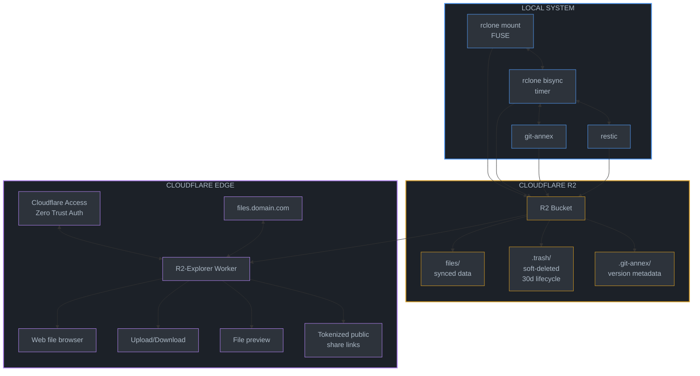

# Phase 1: Repository scaffold + flake.nix

## Overview

A self-contained Nix flake providing Cloudflare R2 cloud storage with:

- Easy bucket creation via CLI
- Local FUSE mount with 2-way background sync
- Version history tracking (git-annex + restic)
- Soft delete/trash with recovery
- Web interface for remote access and sharing (R2-Explorer)
- Authentication via Cloudflare Access

**This is a standalone repository** - completely independent from any existing NixOS configuration. Users import it as a flake input.

## Architecture



## Understanding git-annex (Key Design Decision)

**git-annex is NOT for separate "document buckets"** - it manages large files **within the same git repo** as your code/documents.

**How it works:**

1. In any git repo, `git annex add <large-file>` replaces the file with a symlink
2. The actual content is stored in `.git/annex/objects/` (content-addressed)
3. Git tracks the symlink (small), not the large file content
4. Content syncs to "special remotes" (R2 via rclone) with `git annex sync --content`
5. `git annex get <file>` downloads content; `git annex drop <file>` frees local space

**Example workflow:**

```bash
# In any project with large files
cd ~/projects/video-editing
git init && git annex init "laptop"

# Add R2 as special remote (uses your existing rclone r2 config)
git annex initremote r2 type=rclone \
  rcloneremotename=r2 \
  rcloneprefix=annex/video-editing \
  encryption=none

# Track large files with annex (code stays in git)
git annex add *.mp4 *.mov raw-footage/
git add *.py *.md   # Code/docs tracked normally by git
git commit -m "Initial commit"

# Sync content to R2
git annex sync --content

# Later, free local space
git annex drop raw-footage/  # Content still in R2
git annex get raw-footage/clip1.mp4  # Fetch when needed
```

**Key benefit**: One repo, one bucket prefix, mixed content (code + large files).

**Three sync strategies in this flake:**

| Strategy          | Use Case                            | How It Works                                    |
| ----------------- | ----------------------------------- | ----------------------------------------------- |
| **git-annex**     | Git repos with large files          | Symlinks + special remotes, per-file versioning |
| **rclone bisync** | Non-git folders (Downloads, Photos) | 2-way sync, --backup-dir for trash              |
| **rclone mount**  | Direct R2 access                    | FUSE mount with VFS cache                       |

Sources:

- [git-annex walkthrough](https://git-annex.branchable.com/walkthrough/)
- [rclone special remote](https://git-annex.branchable.com/special_remotes/rclone/)
- [rclone gitannex command](https://rclone.org/commands/rclone_gitannex/)

## Repository Structure

```
r2-cloud-nix/
├── flake.nix                    # Main flake definition
├── flake.lock
├── default.nix                  # Compatibility for non-flake users
│
├── modules/
│   ├── nixos/
│   │   ├── default.nix          # Aggregates all NixOS modules
│   │   ├── r2-sync.nix          # Mount + bisync systemd services
│   │   ├── r2-restic.nix        # Restic snapshots to R2
│   │   └── git-annex.nix        # git-annex with R2 special remote
│   │
│   └── home-manager/
│       ├── default.nix          # Aggregates all HM modules
│       ├── r2-credentials.nix   # Credentials management
│       ├── r2-cli.nix           # CLI integration wrappers (env/default injection)
│       └── rclone-config.nix    # rclone remote configuration
│
├── packages/
│   └── r2-cli.nix               # Primary `r2` subcommand CLI
│
├── lib/
│   └── r2.nix                   # Shared library functions
│
├── r2-explorer/                 # Cloudflare Worker subflake
│   ├── flake.nix
│   ├── package.json
│   ├── pnpm-lock.yaml
│   ├── tsconfig.json
│   ├── vitest.config.ts
│   ├── wrangler.toml
│   ├── src/
│   │   ├── index.ts             # Worker entry point
│   │   ├── app.ts               # Hono app + route handlers
│   │   ├── schemas.ts           # Zod request/response contracts
│   │   ├── auth.ts              # Access/HMAC auth helpers
│   │   ├── kv.ts                # Share KV state operations
│   │   ├── r2.ts                # R2 object operations
│   │   ├── http.ts              # Error/response helpers
│   │   ├── ui.ts                # Embedded dashboard UI
│   │   ├── types.ts             # Worker environment/types
│   │   └── version.ts
│   ├── tests/
│   │   ├── auth.spec.ts
│   │   ├── share.spec.ts
│   │   ├── multipart.spec.ts
│   │   ├── readonly.spec.ts
│   │   ├── server-info.spec.ts
│   │   └── helpers/
│   │       └── memory.ts
│   └── .github/
│       └── workflows/
│           └── deploy.yml       # Phase 7 hardening target
│
├── templates/
│   ├── minimal/                 # Minimal setup template
│   │   └── flake.nix
│   └── full/                    # Full setup with all features
│       └── flake.nix
│
├── docs/
│   ├── quickstart.md
│   ├── credentials.md
│   ├── sync.md
│   ├── versioning.md
│   ├── sharing.md
│   ├── troubleshooting.md
│   ├── operators/
│   │   ├── index.md
│   │   ├── key-rotation.md
│   │   ├── readonly-maintenance.md
│   │   ├── access-policy-split.md
│   │   ├── incident-response.md
│   │   └── rollback-worker-share.md
│   └── reference/
│       └── index.md
│
└── README.md
```

## Flake Definition

```nix
# flake.nix
{
  description = "Cloudflare R2 cloud storage with sync, versioning, and sharing";

  inputs = {
    nixpkgs.url = "github:NixOS/nixpkgs/nixos-unstable";
    home-manager = {
      url = "github:nix-community/home-manager";
      inputs.nixpkgs.follows = "nixpkgs";
    };
    flake-parts.url = "github:hercules-ci/flake-parts";
  };

  outputs = inputs @ { self, nixpkgs, home-manager, flake-parts, ... }:
    flake-parts.lib.mkFlake { inherit inputs; } {
      systems = [ "x86_64-linux" "aarch64-linux" "x86_64-darwin" "aarch64-darwin" ];

      flake = {
        # NixOS modules
        nixosModules = {
          default = import ./modules/nixos;
          r2-sync = import ./modules/nixos/r2-sync.nix;
          r2-restic = import ./modules/nixos/r2-restic.nix;
          git-annex = import ./modules/nixos/git-annex.nix;
        };

        # Home Manager modules
        homeManagerModules = {
          default = import ./modules/home-manager;
          r2-credentials = import ./modules/home-manager/r2-credentials.nix;
          r2-cli = import ./modules/home-manager/r2-cli.nix;
          rclone-config = import ./modules/home-manager/rclone-config.nix;
        };

        # Project templates
        templates = {
          minimal = {
            path = ./templates/minimal;
            description = "Minimal R2 sync setup";
          };
          full = {
            path = ./templates/full;
            description = "Full R2 setup with versioning and web UI";
          };
        };

        # Library functions
        lib = import ./lib/r2.nix { inherit (nixpkgs) lib; };
      };

      perSystem = { pkgs, system, ... }: {
        # CLI packages
        packages = {
          r2 = pkgs.callPackage ./packages/r2-cli.nix { };
          default = pkgs.symlinkJoin {
            name = "r2-cloud-tools";
            paths = [
              self.packages.${system}.r2
            ];
          };
        };

        # Development shell
        devShells.default = pkgs.mkShell {
          packages = with pkgs; [
            rclone
            restic
            git-annex
            nodePackages.wrangler
            nodejs
            jq
          ];
        };

        # Formatter
        formatter = pkgs.nixfmt-rfc-style;
      };
    };
}
```

## Verification

### After Repository Setup

```bash
# Build and check
nix flake check
nix build .#r2

# Test CLI tools
nix run .#r2 -- help
nix run .#r2 -- bucket help
nix run .#r2 -- share help
nix run .#r2 -- share worker help
nix run .#r2 -- rclone --help

# Run full local validation (formats + hooks + module eval + worker tests)
./scripts/ci/validate.sh

# Enter dev shell for manual work
nix develop
```
